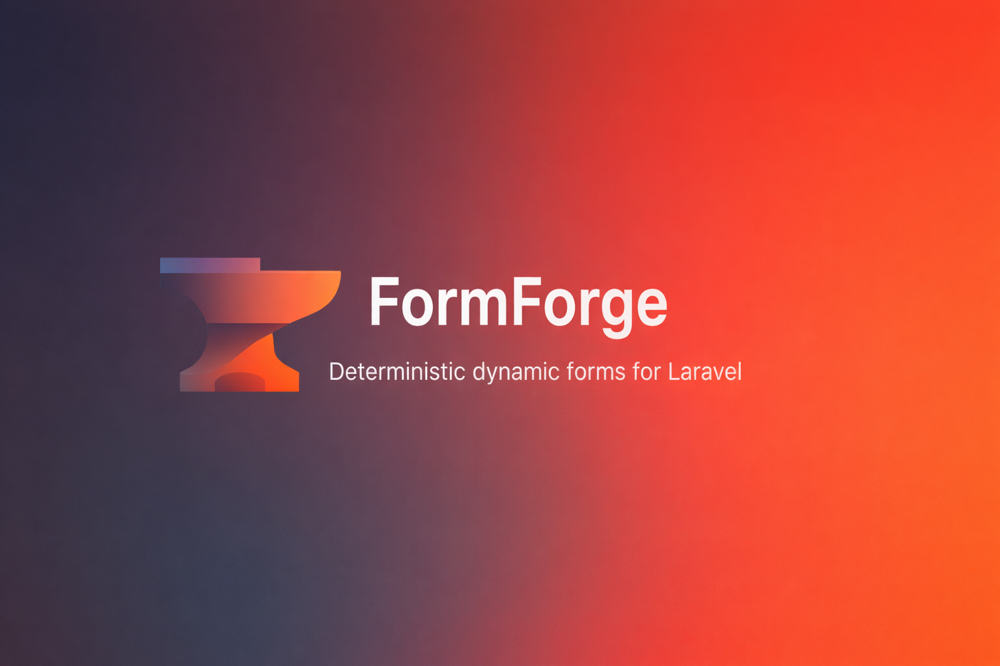

<p align="center">
  
</p>

<h1 align="center">FormForge</h1>

<p align="center">
  Deterministic dynamic forms for Laravel.
</p>

> [!IMPORTANT]
> This README is intentionally lightweight.
> For complete, chaptered documentation, go to:
> [formforge.schleret.ch](https://formforge.schleret.ch)

<p align="center">
  <a href="https://packagist.org/packages/evanschleret/formforge"></a>
  <a href="https://packagist.org/packages/evanschleret/formforge"></a>
  <a href="https://packagist.org/packages/evanschleret/formforge"></a>
  = 8.2" />
  
</p>

## What FormForge Is

FormForge is a backend form engine for Laravel (non-UI):

- deterministic form schema
- immutable form revisions
- strict server-side validation
- built-in HTTP API
- scoped routes and owner-aware authorization
- submission exports (CSV/JSONL)
- GDPR retention/anonymization tools

## Install

```bash
composer require evanschleret/formforge
php artisan formforge:install
php artisan migrate
```

## Quick Start (Code-First)

```php
<?php

declare(strict_types=1);

use EvanSchleret\FormForge\Facades\Form;

Form::define('contact')
    ->title('Contact')
    ->version('1')
    ->text('name')->required()
    ->email('email')->required()
    ->textarea('message')->required();

Form::sync();

$submission = Form::get('contact')->submit([
    'name' => 'Ada',
    'email' => 'ada@example.com',
    'message' => 'Hello',
]);
```

## HTTP API (Optional)

Enable and configure endpoints in `config/formforge.php`, then use routes under:

- `/api/formforge/v1`

Main endpoint groups:

- schema
- submission
- upload
- resolve
- draft
- management

For scoped tenant/context URLs, use `formforge.http.scoped_routes`.

## Common Commands

```bash
php artisan formforge:list
php artisan formforge:describe contact
php artisan formforge:http:routes
php artisan formforge:http:options
php artisan formforge:sync
```

## Full Documentation

Use the full docs for setup patterns, scoped routes, policies, automation resolvers, exports, and GDPR:

- [https://formforge.schleret.ch](https://formforge.schleret.ch)

## License

MIT
